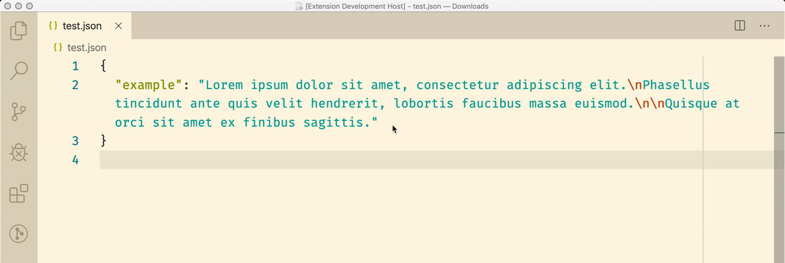
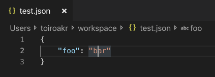
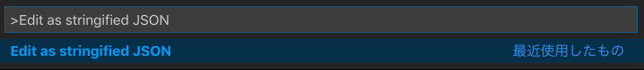
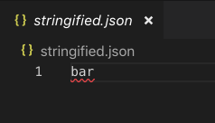
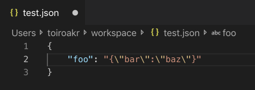

  

  
  

  # Stringified JSON Editor

## Features
Open new column for editing stringified JSON in JSON, and update JSON on save.

## How to Use
### 1. Move caret on target string.

### 2. Open command palette and select `Edit as stringified JSON`.

### 3. Edit JSON in opened `stringified.json`.
|  before  |  after  |
| :----: | :----: |
|    |   |

### 4. Save JSON in opened `stringified.json`, then update original JSON.

## Others
[Issues](https://github.com/toiroakr/stringified-json-editor/issues)

[Releases](https://github.com/toiroakr/stringified-json-editor/releases)
